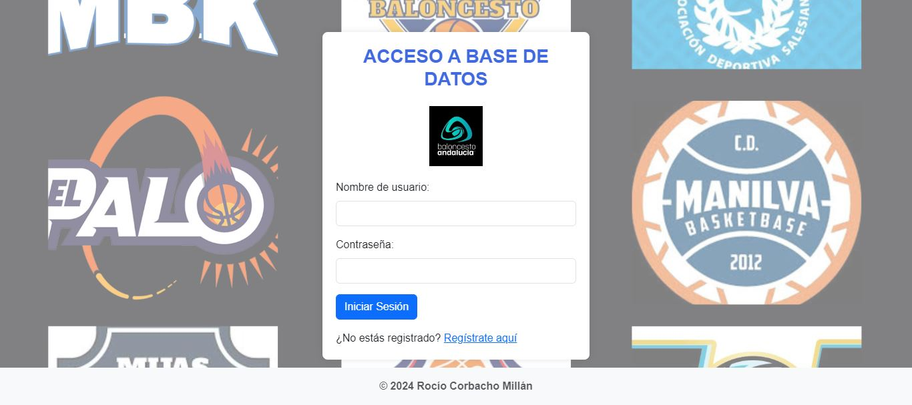
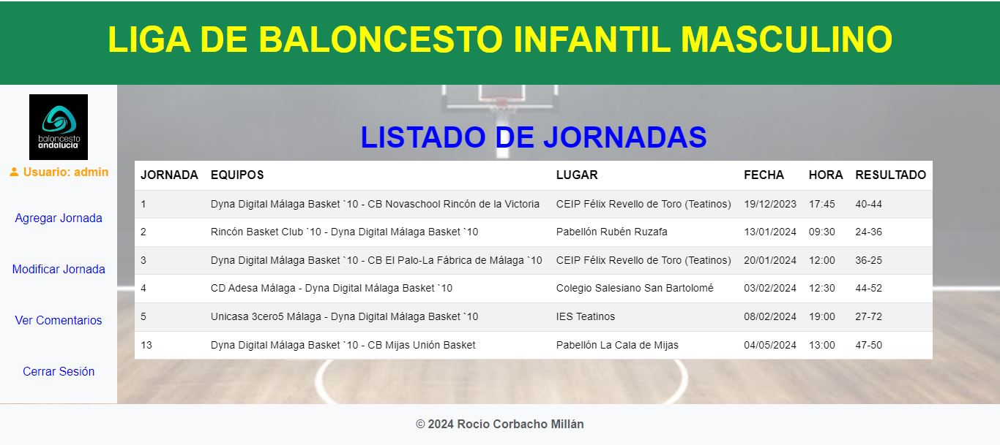
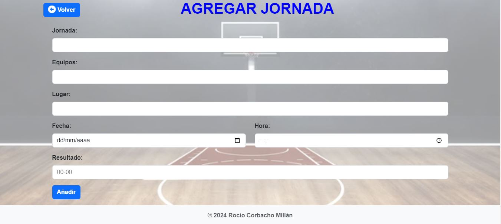
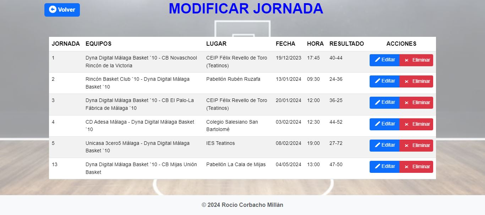
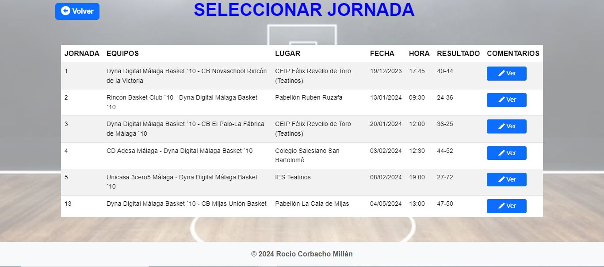
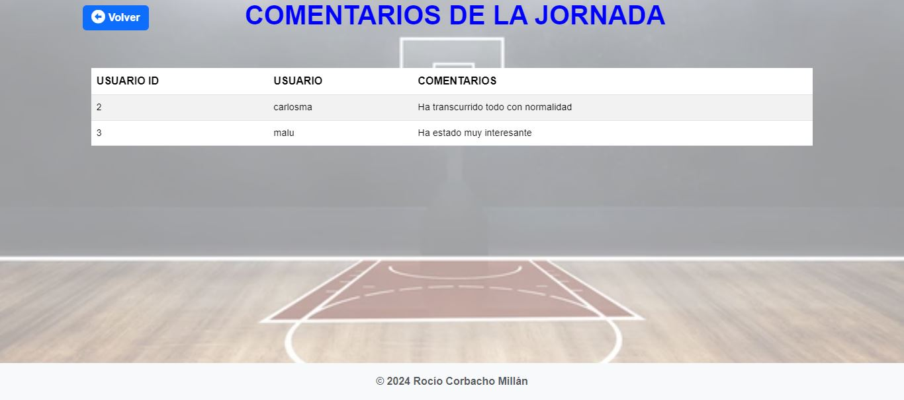
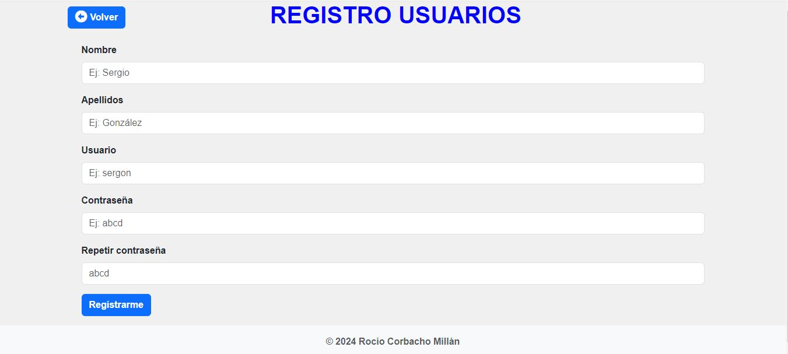

# Proyecto-jsp
Proyecto que consiste en gestionar una base de datos, en este caso es una liga de baloncesto infatil masculino local.
En la base de datos se pueden registrar usuarios. Todos los usuarios pueden ver todas las jornadas, así como agregar comentarios y ver los comentarios de las jornadas. El usuario admin es el único que puede agregar jornadas, editarlas, eliminarlas.

# Capturas

